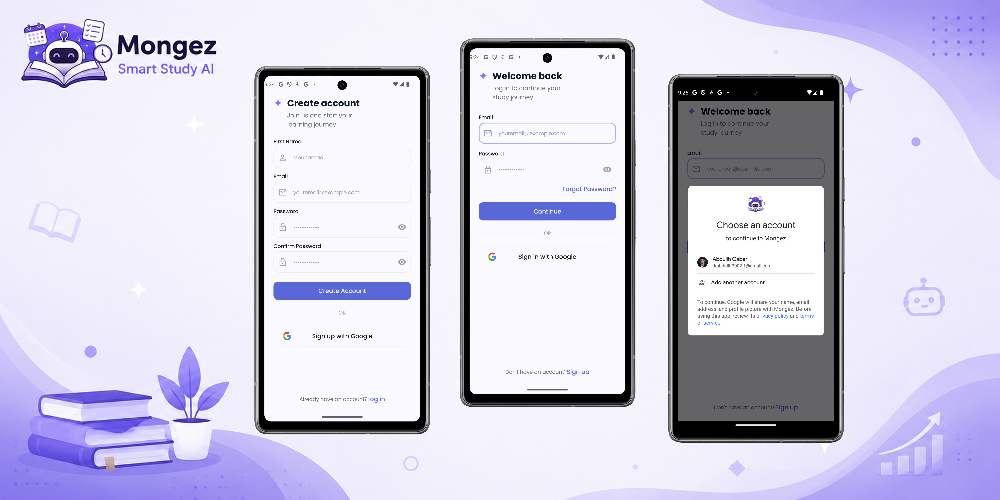
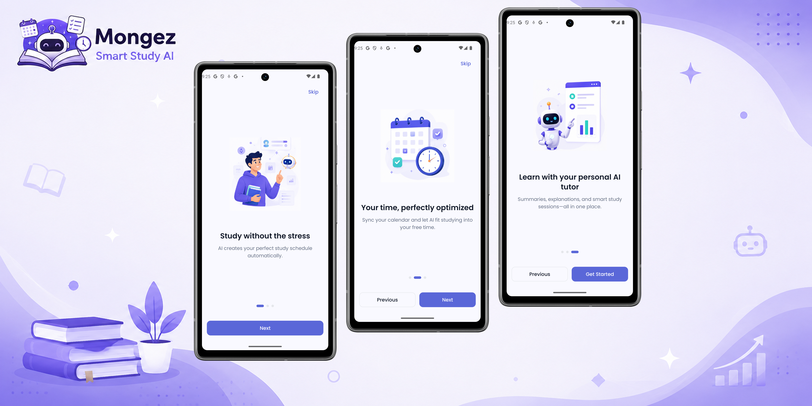
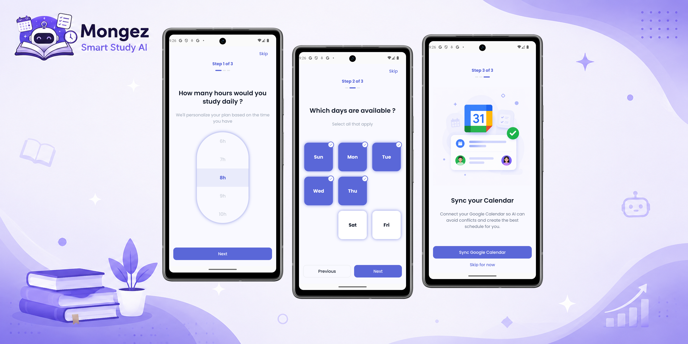
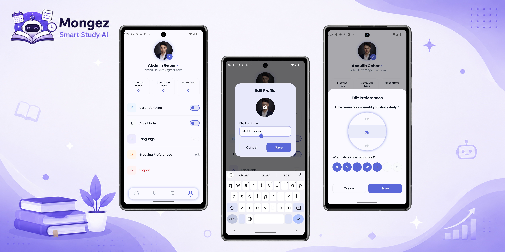

<p align="center">
  
</p>

<h1 align="center">Mongez — AI Smart Study Planner</h1>

<p align="center">
  <strong>Your AI-powered academic companion for smarter, stress-free studying.</strong>
</p>

<p align="center">
  
  
  
  
  
  
  
</p>

---

## 📖 About

**Mongez** (Arabic: مُنْجَز — *"Accomplished"*) is a modern Android application that reimagines how students plan, track, and conquer their academic workload. Powered by an **AI-driven roadmap engine** and a **contextual study assistant**, Mongez dynamically schedules your semester, adapts when life happens, and provides grounded explanations right inside your study room — so you stay focused and always prepared.

---

## ✨ Features at a Glance

| Feature | Description |
| :--- | :--- |
| 🔐 **Authentication** | Sign in with **Google One Tap** or register with email via **Firebase Auth**. Secure credential management with the Android Credentials API. |
| 📋 **Preferences (Onboarding)** | First-launch wizard to collect study preferences — study hours per day, preferred study times, academic level, and semester schedule — to personalize the AI roadmap. |
| 🏠 **Dashboard** | A command center displaying **upcoming tasks**, **current streak**, **total study hours**, **completed task count**, and quick access to today's schedule. |
| 📚 **Courses** | Add and manage courses with full details. Each course opens to reveal two tabs: **Materials** (uploaded resources) and **Tasks** (assignments, quizzes, exams). |
| 🗺️ **Roadmap** | An AI-generated, dynamic semester timeline created automatically when a new course is added. The **Dynamic Roadmap Engine** reactively reschedules remaining tasks when assessments are injected (e.g., pop quizzes). |
| 👤 **Profile** | View and edit your name, avatar, and study preferences. Displays accumulated stats — study hours, completed tasks, and current streak. |
| 🤖 **AI Study Room** | Activated when a user clicks on a task. An in-context **Contextual AI Assistant** provides pedagogical summaries and deep-dive Q&A grounded solely in the uploaded course materials. |

---

## 🖼️ Screenshots

<p align="center">
  
</p>

### Authentication
<p align="center">
  <br />
  <sub><b>Register · Login · Google One Tap Sign-In</b></sub>
</p>

### Onboarding
<p align="center">
  <br />
  <sub><b>AI Study Introduction · Time Optimization · Personal AI Tutor</b></sub>
</p>

### Preferences
<p align="center">
  <br />
  <sub><b>Daily Study Hours · Available Days · Google Calendar Sync</b></sub>
</p>

### Profile
<p align="center">
  <br />
  <sub><b>Profile Overview · Edit Profile · Edit Preferences</b></sub>
</p>

### Roadmap
<p align="center">
  <br />
  <sub><b>Timeline · Filter · Add Event (Type · Details · Course)</b></sub>
</p>

### Courses, Tasks & AI Study Room
<p align="center">
  <br />
  <sub><b>My Courses · Tasks · AI Chat with Material Summaries & Q&A</b></sub>
</p>

---

## 🏗️ Architecture

Mongez follows **Multi-Module Clean Architecture** with the **MVI (Model-View-Intent)** pattern on the presentation layer. The project enforces strict layer separation — dependencies flow **inward** from outer layers (App → Presentation → Domain), while the Data layer implements Domain-defined interfaces.

### Module Dependency Graph

```
┌──────────────────────────────────────────────────────┐
│                      :app                            │
│   (Hilt DI init, Navigation Host, Splash Screen)     │
└────┬────────┬──────────┬──────────┬─────────┬────────┘
     │        │          │          │         │
     ▼        ▼          ▼          ▼         ▼
┌─────────┐ ┌──────┐ ┌──────────┐ ┌────┐ ┌──────────────┐
│:present-│ │:data │ │:navigat- │ │:do-│ │:design_system│
│ation    │ │      │ │ion       │ │main│ │              │
└────┬────┘ └──┬───┘ └──────────┘ └────┘ └──────────────┘
     │         │                    ▲           ▲
     │         └────────────────────┘           │
     └──────────────────────────────────────────┘
```

### Layer Responsibilities

| Module | Layer | Responsibility | Depends On |
| :--- | :--- | :--- | :--- |
| **`:app`** | Application | Hilt DI initialization, `NavHost` setup, splash screen, shared signing keystore | All modules |
| **`:presentation`** | Presentation | MVI contracts (`State`, `Intent`, `Effect`), ViewModels, UI Screens, UI Mappers | `:domain`, `:design_system` |
| **`:domain`** | Domain | Pure Kotlin business logic, Use Cases, Repository interfaces, `Result<T>` wrapper, custom exceptions | None *(zero Android dependencies)* |
| **`:data`** | Data | Repository implementations, Retrofit API services, DTOs, Mappers, `safeApi` network wrapper, Room DB, DataStore | `:domain` |
| **`:design_system`** | Design System | Reusable Compose components, design tokens (colors, typography, spacing, radius, elevation, motion), fonts, icons, illustrations | Compose Foundation only |
| **`:navigation`** | Navigation | Centralized route definitions and navigation graph contracts | — |
| **`build-logic`** | Build Infrastructure | Convention plugins (`mongez.android.application`, `mongez.compose`, `mongez.android.hilt`, etc.) for consistent Gradle configuration | Gradle API |

### MVI Flow (Presentation Layer)

```
User Action ──▶ Intent ──▶ ViewModel ──▶ Use Case (Domain) ──▶ Repository (Data)
                               │                                       │
                               ◀────── Result<T> ◀─────────────────────┘
                               │
                          ┌────┴────┐
                          ▼         ▼
                       State     Effect
                     (persist)  (one-shot)
                          │         │
                          ▼         ▼
                    UI Render   Navigation /
                               Snackbar /
                               Toast
```

### Domain Result Wrapper

```kotlin
sealed class Result<out T> {
    data class Success<out T>(val data: T) : Result<T>()
    data class Failure(val exception: Throwable) : Result<Nothing>()
    object Loading : Result<Nothing>()
}
```

---

## 📂 Project Structure

```
Mongez/
├── app/                          # Application entry point
│   ├── src/main/java/.../
│   │   ├── MongezApp.kt         # Hilt Application class
│   │   ├── MainActivity.kt      # Single Activity host
│   │   └── ui/theme/            # App-level theme bridge
│   └── google-services.json     # Firebase config
│
├── presentation/                 # Feature screens (MVI)
│   └── src/main/java/.../presentation/
│       ├── auth/                 # Login & Register
│       │   ├── login/            # contract/ uiState/ view/ viewmodel/
│       │   └── register/        # contract/ uiState/ view/ viewmodel/
│       ├── onboarding/          # First-launch preferences wizard
│       ├── preferences/         # Study preferences configuration
│       ├── dashboard/           # Home screen with upcoming tasks
│       ├── courses/             # Course list & add course
│       ├── coursedetails/       # Materials & Tasks tabs
│       ├── roadmap/             # AI-generated semester timeline
│       ├── profile/             # User profile & edit preferences
│       ├── studyroom/           # AI Chat on task click
│       ├── main/                # Main scaffold & bottom nav
│       └── utils/               # Presentation utilities
│
├── domain/                       # Pure Kotlin business core
│   └── src/main/kotlin/.../domain/
│       ├── auth/                 # model/ repository/ usecase/
│       ├── courses/             # model/ repository/ usecase/
│       ├── dashboard/           # model/ repository/ usecase/
│       ├── roadmap/             # model/ repository/ usecase/
│       ├── profile/             # model/ repository/ usecase/
│       ├── preferences/         # model/ repository/ usecase/
│       ├── calendar/            # model/ repository/ usecase/
│       ├── onboarding/          # repository/ usecase/
│       ├── settings/            # model/ repository/ usecase/
│       ├── core/                # Result<T>, exceptions, base use cases
│       └── utils/               # Domain utilities
│
├── data/                         # Data access & networking
│   └── src/main/java/.../data/
│       ├── sources/
│       │   ├── remote/services/ # Retrofit API interfaces
│       │   └── local/           # Local data sources
│       ├── repositories/        # Repository implementations
│       │   ├── auth/            # Firebase + backend auth
│       │   ├── courses/         # Course CRUD operations
│       │   ├── dashboard/       # Dashboard data aggregation
│       │   ├── roadmap/         # Roadmap generation
│       │   ├── profile/         # Profile management
│       │   ├── preferences/     # DataStore preferences
│       │   ├── calendar/        # Calendar events
│       │   ├── onboarding/      # Onboarding state
│       │   └── settings/        # App settings
│       ├── dtos/                # Data Transfer Objects
│       ├── mapper/              # DTO → Domain model mappers
│       ├── local/               # Room DB (dao/ db/ entity/)
│       ├── di/                  # Hilt data modules
│       └── utils/network/       # safeApi, handleException
│
├── design_system/                # Visual identity & components
│   └── src/main/java/.../designsystem/
│       ├── theme/               # MongezTheme, CompositionLocals
│       ├── foundation/          # Design tokens
│       │   ├── color/           # Semantic color system
│       │   ├── typography/      # Poppins + IBM Plex Sans Arabic
│       │   ├── spacing/         # 8dp grid system
│       │   ├── radius/          # Corner radius scale
│       │   ├── elevation/       # Shadow levels
│       │   ├── motion/          # Animation durations & easings
│       │   └── modifier/        # Common modifier extensions
│       ├── components/          # Reusable App* composables
│       │   ├── button/          # AppButton variants
│       │   ├── textfield/       # AppTextField variants
│       │   ├── card/            # AppCard, CourseCard, TaskCard...
│       │   ├── navigation/      # AppNavigationBar
│       │   ├── appbar/          # AppTopAppBar
│       │   ├── dialog/          # AppDialog variants
│       │   ├── sheet/           # AppBottomSheet
│       │   ├── chip/ tabs/ fab/ # Additional components
│       │   └── ...
│       ├── screens/             # Screen-specific composables
│       └── resources/           # Fonts, icons, illustrations
│
├── navigation/                   # Route definitions
│   └── src/main/java/.../navigation/
│
├── build-logic/                  # Gradle convention plugins
│   └── convention/src/.../
│       ├── AndroidApplicationConventionPlugin.kt
│       ├── AndroidLibraryConventionPlugin.kt
│       ├── AndroidLibraryComposeConventionPlugin.kt
│       ├── ComposeConventionPlugin.kt
│       ├── AndroidHiltConventionPlugin.kt
│       └── KotlinLibraryConventionPlugin.kt
│
├── docs/                         # Documentation
│   ├── ArchitectureLayers.md
│   ├── DesignSystem.md
│   ├── GitBranchNamingConventions.md
│   └── handshake_contract.md
│
├── keystores/                    # Shared debug signing keystore
├── gradle/libs.versions.toml    # Centralized version catalog
└── settings.gradle.kts          # Module inclusion
```

---

## 🔐 Authentication Flow

Mongez uses **Firebase Authentication** with **Google One Tap Sign-In** through the modern Android **Credentials API**.

```
┌──────────────┐      Firebase Token      ┌──────────────┐
│   Google      │ ──────────────────────▶ │   Firebase    │
│   One Tap     │                         │   Auth        │
└──────────────┘                          └──────┬───────┘
                                                 │ JWT
                                                 ▼
                                          ┌──────────────┐
                                          │   Backend     │
                                          │   REST API    │
                                          └──────┬───────┘
                                                 │
                                    ┌────────────┴────────────┐
                                    ▼                         ▼
                            POST /auth/register       POST /auth/login
                            (token + name)            (token only)
                                    │                         │
                                    ▼                         ▼
                            Returns user +            Returns user +
                            stats (zeroed)            stats (current)
```

**Registration** sends the Firebase JWT token alongside the user's name. The backend securely initializes all stats to zero.

**Login** sends only the token. The backend verifies it, looks up the user, and returns their accumulated progress (study hours, completed tasks, current streak).

---

## 📱 Screen-by-Screen Breakdown

### 1. Authentication Screen
- Google One Tap sign-in button
- Email/password registration form
- Smooth animated transitions between login and register modes
- Input validation with real-time error feedback
- Secure credential management via `androidx.credentials`

### 2. Preferences Screen (Onboarding)
- Multi-step wizard collecting study preferences
- Study hours per day, preferred study times, academic level
- Semester start/end dates configuration
- Data persisted via DataStore and synced to backend
- Only shown on first launch or when preferences are reset

### 3. Dashboard Screen
- **Greeting header** with user's name and avatar
- **Stats cards**: Total Study Hours, Completed Tasks, Current Streak
- **Upcoming Tasks** list sorted by due date with priority indicators
- Quick-access to today's scheduled study sessions
- Pull-to-refresh for live data sync

### 4. Courses Screen
- Grid/list view of all enrolled courses
- **Floating Action Button** to add a new course
- Course cards showing name, progress percentage, and task count
- Search and filter functionality
- Clicking a course navigates to Course Details

### 5. Course Details Screen
- **Two-tab layout**: **Materials** | **Tasks**
- **Materials Tab**: View and manage uploaded study resources
- **Tasks Tab**: List of assignments, quizzes, and exams with due dates and completion status
- Clicking a task launches the **AI Study Room**

### 6. Roadmap Screen
- **AI-generated semester timeline** created when a course is added
- Visual timeline showing task distribution across weeks
- **Dynamic Roadmap Engine** reactively reschedules when:
  - A new assessment is injected (e.g., surprise quiz)
  - Task priorities shift based on upcoming deadlines
- Color-coded by course and task type

### 7. Profile Screen
- View and edit display name and avatar
- Modify study preferences (re-opens preferences editor)
- View accumulated stats (study hours, completed tasks, streak)
- Account settings and sign-out

### 8. AI Study Room (Chat)
- Activated on task click from Course Details
- **Contextual AI Assistant** grounded in uploaded course materials
- Pedagogical summaries auto-generated for each topic
- Deep-dive Q&A for focused, in-context learning
- Disabled for custom/external courses to maintain content grounding

---

## 🧩 Dependencies

### Core Android & Kotlin

| Library | Version |
| :--- | :--- |
|  | `2.2.10` |
|  | `9.2.1` |
|  | `1.19.0` |
|  | `2.11.0` |
|  | `2.11.0` |
|  | `2.2.10-2.0.2` |

### Jetpack Compose

| Library | Version |
| :--- | :--- |
|  | `2026.02.01` |
|  | `1.13.0` |
|  | *BOM managed* |
|  | *BOM managed* |

### Navigation

| Library | Version |
| :--- | :--- |
|  | `2.8.5` |
|  | `1.1.3` |
|  | `1.1.3` |

### Dependency Injection

| Library | Version |
| :--- | :--- |
|  | `2.60.1` |
|  | `1.2.0` |
|  | `1` |

### Networking & Serialization

| Library | Version |
| :--- | :--- |
|  | `2.11.0` |
|  | `2.10.1` |
|  | `2.11.0` |

### Firebase & Authentication

| Library | Version |
| :--- | :--- |
|  | `23.0.0` |
|  | `24.0.0` |
|  | `1.5.0-rc01` |
|  | `1.5.0-rc01` |
|  | `1.1.1` |
|  | `4.4.2` |

### Async & Coroutines

| Library | Version |
| :--- | :--- |
|  | `1.10.1` |
|  | `1.10.1` |

### Local Storage

| Library | Version |
| :--- | :--- |
|  | `2.6.1` |
|  | `2.6.1` |
|  | `2.6.1` |
|  | `1.1.2` |

### Image Loading

| Library | Version |
| :--- | :--- |
|  | `2.7.0` |

### UI & Splash

| Library | Version |
| :--- | :--- |
|  | `1.0.1` |

### Testing

| Library | Version |
| :--- | :--- |
|  | `4.13.2` |
|  | `1.3.0` |
|  | `3.7.0` |
|  | *BOM managed* |

---

## 🛠️ Build & Convention Plugins

Mongez uses a **`build-logic`** module with custom Gradle convention plugins to enforce consistent configuration across all modules:

| Plugin ID | Purpose |
| :--- | :--- |
| `mongez.android.application` | Android Application defaults (compileSdk 37, minSdk 26, targetSdk 37, JVM 21) |
| `mongez.android.library` | Android Library module configuration |
| `mongez.android.library.compose` | Library + Compose compiler setup |
| `mongez.compose` | Jetpack Compose compiler configuration |
| `mongez.android.hilt` | Dagger Hilt + KSP annotation processing |
| `mongez.kotlin.library` | Pure Kotlin library module (for `:domain`) |

---

## 🌍 Localization

Mongez supports **dual-language** UI:

- 🇺🇸 **English** — Poppins font family
- 🇸🇦 **Arabic** — IBM Plex Sans Arabic font family

Full **RTL (Right-to-Left)** support with `Start`/`End` alignment semantics throughout the design system.

---

## 🎨 Design System

The Design System is the **single source of truth** for the app's visual identity, built on **Material 3 Foundation** with a fully custom token layer.

- **Brand Color**: Purple `#5B4CF6` — representing intelligence, trust, and focus
- **8dp Grid Spacing System** for consistent layout rhythm
- **Semantic Color Scheme** with full Light/Dark theme support
- **Accessibility First**: WCAG AA contrast ratios (4.5:1), minimum 48dp touch targets, font scaling up to 2.0x
- **Component Library**: All reusable components prefixed with `App` — `AppButton`, `AppTextField`, `AppCard`, `AppDialog`, `AppBottomSheet`, `AppNavigationBar`, `AppTopAppBar`, and more

> 📄 Full specification: [`docs/DesignSystem.md`](docs/DesignSystem.md) (3,700+ lines)

---

## 🚀 Getting Started

### Prerequisites

- **Android Studio** Ladybug (2024.3+) or newer
- **JDK 21**
- **Android SDK** with compileSdk 37
- A Firebase project with `google-services.json`

### Setup

1. **Clone the repository**
   ```bash
   git clone https://github.com/your-org/Mongez.git
   cd Mongez
   ```

2. **Add Firebase configuration**
   Place your `google-services.json` in the `app/` directory.

3. **Configure local properties**
   Create or edit `local.properties` in the project root:
   ```properties
   GOOGLE_WEB_CLIENT_ID=your_google_web_client_id_here
   ```

4. **Build & Run**
   ```bash
   ./gradlew assembleDebug
   ```
   Or open the project in Android Studio and click ▶️ Run.

---

## 📐 Development Guidelines

### Branch Naming Convention
```
<type>/<description>       e.g. feature/user-auth
<type>/<ticket>-<desc>     e.g. feature/PROJ-123-user-auth
```
Types: `feature/` · `bugfix/` · `hotfix/` · `refactor/` · `docs/` · `test/` · `chore/`

### PR Naming Convention
```
<type>: <short description>          e.g. feat: add login screen
<type>(<ticket>): <short desc>       e.g. feat(PROJ-123): add user authentication
```

### Coding Standards
- ✅ Use modern Compose APIs (e.g., `HorizontalDivider`, not `Divider`)
- ✅ Place reusable UI components in `:design_system`, not in feature modules
- ✅ Use design tokens (`Theme.spacing.*`, `Theme.colorScheme.*`, `Theme.typography.*`) — no hardcoded values
- ✅ Include `@Preview` with realistic dummy data for every screen
- ✅ Add new dependencies to `gradle/libs.versions.toml` first, then reference in `build.gradle.kts`

---

## 🤝 Contributing

1. Fork the repository
2. Create a feature branch (`feature/amazing-feature`)
3. Commit your changes following the PR naming convention
4. Push to the branch and open a Pull Request
5. Include screenshots/recordings for any UI changes

---

## 📄 License

This project is developed as part of the **ITI (Information Technology Institute)** program.

---

<p align="center">
  <b>Built with ❤️ using Kotlin, Jetpack Compose, and a lot of ☕</b>
</p>
